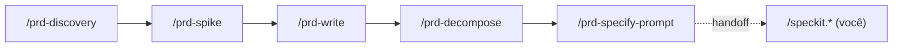

# Como usar o harness PRD → Spec Kit (exemplos do Zion Mermaid Editor)

> **O que este documento é:** um **guia prático** dos 5 comandos `/prd-*` — o harness que
> *executa* o processo do `guia-prd-para-spec-kit.md`. Enquanto aquele guia **descreve** os seis
> estágios de forma genérica, este mostra **como rodar** cada comando, com exemplos reais do
> **Zion Mermaid Editor**.
>
> **Fronteira, sempre:** a PRD e o input do `/speckit.specify` carregam *o-quê / por-quê*; o
> `plan.md` de cada feature carrega *como / com quê*. Stack só aparece nos **ADRs** (Estágio 2) e
> no `plan.md` — nunca na PRD. As regras vivem em `.specify/prd/quality-rules.md`.

---

## Quando usar o harness (e quando não)

- **Use o harness** (`/prd-*`) quando quiser que o Claude **dirija** o fluxo: perguntar o que falta,
  validar entrada e saída, formatar no padrão e delegar à skill real. Menos passos manuais.
- **Use o guia narrativo** (`guia-prd-para-spec-kit.md`) quando quiser entender o *porquê* de cada
  estágio, ou executar algum passo à mão.
- **Todo gate aconselha, nunca bloqueia.** Cada comando emite um veredito (`✓` / `⚠ + sugestão`) e
  **você decide** seguir. Nada trava você.

---

## Mapa rápido dos comandos

| Comando | Estágio | Lê (pré-requisito) | Produz | Delega a |
|---|---|---|---|---|
| `/prd-discovery` | 1 · Descoberta | *(nada)* | `docs/discovery.md` | `superpowers:brainstorming` |
| `/prd-spike` | 2 · Spikes + ADRs | `docs/discovery.md` | `docs/adr/ADR-00x-*.md` | `deep-research` → `adr-new` |
| `/prd-write` | 3 · PRD enxuta | `docs/discovery.md` + `docs/adr/` | `docs/PRD.md` | `superpowers:brainstorming` |
| `/prd-decompose` | 4 · Decomposição | `docs/PRD.md` (com `RF-xx`) | fatias + tabela na PRD | `superpowers:brainstorming` |
| `/prd-specify-prompt` | Ponte p/ 5b | backlog de fatias | prompt do `/speckit.specify` | `rewrite-prompt` |

O harness termina na ponte: o ciclo `/speckit.*` (specify → clarify → plan → … → implement) é **seu**.



---

## Caminho feliz, ponta a ponta, com o Zion

O Zion parte de um stub em `docs/index.md` ("Editor de diagrama mermaid com experiência visual").
Abaixo, o fluxo completo — o que **você digita** e o que o comando **faz/responde**.

### Estágio 1 — `/prd-discovery`

Você digita:

```text
/prd-discovery Um editor de diagramas mermaid com experiência visual: a pessoa escreve
mermaid e vê a prévia atualizar ao digitar, e também consegue editar o diagrama direto no
canvas. Público: quem documenta arquitetura de software.
```

O comando **valida a entrada** (Fase 1): tem problema + persona candidata? ✓. Se você tivesse
colado "vou usar React + mermaid.js", ele avisaria: *"⚠ isso é stack — cedo demais; aqui é só visão
e escopo"*. Depois **delega a `brainstorming`** com o enquadramento fixo (visão-1-frase, persona,
faz/não-faz) e grava `docs/discovery.md`.

Resultado esperado em `docs/discovery.md`:

```markdown
## Visão
Para quem documenta arquitetura de software, que perde tempo alternando entre a sintaxe mermaid e a
prévia, o Zion é um editor visual que atualiza a prévia ao digitar e deixa editar no canvas.

## Persona
- **Ana, engenheira de software** — mantém diagramas de arquitetura no repositório e quer iterar
  rápido sem decorar sintaxe.

## Faz / Não faz
- **Faz:** editar mermaid por texto; prévia ao vivo; editar no canvas; exportar imagem.
- **Não faz (out):** colaboração multiusuário em tempo real; controle de versão tipo git;
  diagramas não-mermaid (PlantUML, draw.io); login/conta na primeira release.
```

**Fase 4 (veredito):** `✓ visão em 1 frase · ✓ persona nomeada (Ana) · ✓ "não faz" explícito`.

### Estágio 2 — `/prd-spike`

Filtre pelas **2–3 decisões que mudam a PRD inteira** (não dúvidas pequenas). Para o Zion:

```text
/prd-spike Três decisões estruturantes:
1. Motor de renderização do diagrama (mermaid.js oficial vs. render próprio).
2. Sincronização bidirecional texto ↔ canvas (round-trip do diagrama).
3. Onde o diagrama persiste entre sessões.
```

O comando roda, por decisão: **`deep-research`** (trade-offs) → **`adr-new`** (registra o ADR).
Aqui **stack pode e deve aparecer** — o ADR é o lar do "como". Saída:

```text
docs/adr/ADR-001-motor-de-renderizacao.md
docs/adr/ADR-002-sincronizacao-texto-canvas.md
docs/adr/ADR-003-persistencia-local.md
```

**Fase 4:** avisa se algum ADR não referencia um spike de fato rodado — *"sem spike, a spec nasce
ambígua"*. Cada ADR aceito vira **restrição** na seção 8 da PRD.

### Estágio 3 — `/prd-write` (o coração)

```text
/prd-write
```

Sem argumento: trabalha sobre `docs/discovery.md` + `docs/adr/`. **Fase 2** copia
`.specify/prd/templates/prd-skeleton.md` → `docs/PRD.md` (12 seções em branco). **Fase 3** delega a
`brainstorming` para preencher **seção a seção**. Trecho da PRD resultante:

```markdown
## 6. Requisitos funcionais por épico (RF-xx)
- **Épico E1 — Edição por texto com prévia:**
  - `RF-01` A pessoa escreve mermaid e vê a prévia renderizar ao digitar.
  - `RF-02` Erros de sintaxe são apontados sem descartar a última prévia válida.
- **Épico E2 — Edição visual no canvas:**
  - `RF-03` Arrastar um nó no canvas atualiza o texto mermaid correspondente.
  - `RF-04` Adicionar um nó/aresta pelo canvas passa a constar no texto.
- **Épico E3 — Persistência e exportação:**
  - `RF-05` As alterações do diagrama persistem entre sessões.
  - `RF-06` A pessoa exporta o diagrama como imagem.

## 7. NFRs (com números)
- `NFR-01` A prévia atualiza em até 200 ms após a digitação parar.
- `NFR-02` Diagramas de até 200 nós mantêm interação abaixo de 100 ms.
```

**Fase 4 — guarda de fronteira.** Confere: escopo in/out ✓, `RF-xx` por épico (1 frase) ✓, NFRs
com número ✓, **zero stack/critério de aceite/tela**. Se uma linha vazar (veja o exemplo de gate
abaixo), ela aponta a linha exata e sugere mover para o `plan.md`.

### Estágio 4 — `/prd-decompose`

```text
/prd-decompose
```

Delega a `brainstorming`: agrupa `RF-xx` em épicos → story map → cortes de release → **fatias
verticais**. Cada fatia é validada pelo **INVEST** (teste-relâmpago: *"esta fatia, sozinha, dá uma
demo ponta-a-ponta?"*). Para o Zion:

- **R0 (walking skeleton):** *digitar mermaid → ver prévia → recarregar e continuar.* Corta E1+E3 no
  mínimo e prova o pipeline texto→render→persistência inteiro. É a fatia zero.
- **R1:** apontar erro de sintaxe (`RF-02`); exportar imagem (`RF-06`).
- **R2:** editar no canvas — arrastar nó (`RF-03`), adicionar nó (`RF-04`).

E **injeta a tabela** de `.specify/prd/templates/traceability-table.md` na **seção 12** da PRD:

```markdown
| RF | Descrição (1 frase) | Épico | Feature / Spec | Release | Status |
|----|---------------------|-------|----------------|---------|--------|
| RF-01 | Prévia renderiza ao digitar | E1 | `specs/001-preview-ao-vivo` | R0 | ☐ pendente |
| RF-05 | Diagrama persiste entre sessões | E3 | `specs/001-preview-ao-vivo` | R0 | ☐ pendente |
| RF-02 | Erro de sintaxe apontado | E1 | `specs/002-erros-sintaxe` | R1 | ☐ pendente |
```

### Ponte — `/prd-specify-prompt`

Aponte **qual** fatia da fila. Para o walking skeleton:

```text
/prd-specify-prompt A fatia R0: digitar mermaid, ver a prévia, recarregar e o diagrama continuar.
```

Delega a `rewrite-prompt` montando o XML com as 3 tags de `#anatomia-specify` e **entrega o comando
pronto** (não dispara nada):

```text
/speckit.specify "
<context>
Referência (não requisito): RF-01 (prévia ao digitar), RF-05 (persistência entre sessões).
ADR-001 (motor de render), ADR-003 (persistência local).
</context>
<success_criteria>
A pessoa abre o editor, digita um diagrama mermaid e vê a prévia renderizar; ao recarregar a
página, o diagrama e a prévia continuam lá.
</success_criteria>
<constraints>
Não citar linguagem, framework ou biblioteca — stack fica no plan. Sem critérios de aceite
detalhados nem telas.
</constraints>
"
```

**PARE.** A partir daqui o ciclo `/speckit.*` é seu.

---

## Os gates em ação (o que você vê)

O harness **aconselha, não bloqueia**. Cinco situações concretas:

### 1. Gate mole dispara, mas não trava
Rodar `/prd-write` **sem** `docs/discovery.md`:

> ⚠ Não encontrei `docs/discovery.md`. Recomendo rodar `/prd-discovery` e `/prd-spike` antes.
> Quer seguir mesmo assim?

Responda "sim" e ele prossegue. (Prova: aconselha, não bloqueia.)

### 2. Fronteira vazada — aponta a linha
Se a seção 6 da PRD tiver:

```markdown
- `RF-03` Usar React Flow para arrastar nós no canvas.
```

`/prd-write` em modo revisar responde:

> ⚠ Vazamento de fronteira em `RF-03`: cita **React Flow** (biblioteca). Isso é "como" → move para o
> `plan.md` da feature. Reescreva o `RF-03` como resultado: *"Arrastar um nó no canvas atualiza o
> texto mermaid"* (veja `quality-rules.md` `#fronteira`).

### 3. Idempotência — modo revisar
Rodar `/prd-write` com `docs/PRD.md` **já existente**: ele **não sobrescreve** — entra em modo
*pressionar seção a seção*, apontando o que está fraco na PRD atual.

### 4. INVEST reprova fatia horizontal
Dar ao `/prd-decompose` uma fatia "só o canvas visual, sem ligar ao texto":

> ⚠ Fatia horizontal: é "só a UI" — não passa no teste "dá uma demo sozinha?". Sugiro refatiar pelos
> eixos do **SPIDR** (ex.: começar pela **I**nterface mínima que já lê e escreve o texto).

### 5. Handoff termina o território
`/prd-specify-prompt` **entrega** o texto do `/speckit.specify` e **para** — nunca dispara um
`/speckit.*`. O ciclo do Spec Kit é seu.

---

## Onde afinar o padrão

Tudo num lugar só — mexa aqui, não nos comandos:

- **Regras de qualidade** (fronteira, critérios de conclusão, INVEST/SPIDR, anatomia do specify):
  `.specify/prd/quality-rules.md`.
- **Esqueleto da PRD** (12 seções): `.specify/prd/templates/prd-skeleton.md`.
- **Tabela de rastreabilidade:** `.specify/prd/templates/traceability-table.md`.

Os comandos `/prd-*` **apontam** para esses arquivos em vez de repetir as regras — afinar o padrão
de qualidade é editar um arquivo só.

---

## Resumo de bolso

1. `/prd-discovery <ideia>` → `docs/discovery.md` (visão, persona, faz/não-faz).
2. `/prd-spike <2–3 decisões>` → `docs/adr/` (aqui stack pode aparecer).
3. `/prd-write` → `docs/PRD.md` (RF-xx por épico, **sem stack**).
4. `/prd-decompose` → fatias verticais + tabela na PRD; R0 = walking skeleton.
5. `/prd-specify-prompt <fatia>` → `/speckit.specify "..."` pronto → **você** dispara o Spec Kit.
