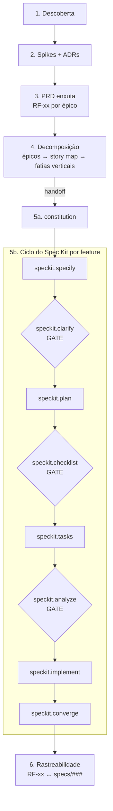

# Guia de processo — PRD → épicos → features prontas para o Spec Kit (via skills do Claude Code CLI)

> **O que este documento é:** um **guia de execução** (how-to / manual de processo). Ele
> *descreve como executar* cada passo — qual skill usar, com que comando, com que argumentos e o
> que esperar. Ele **não executa** o processo: nenhuma PRD é escrita aqui, nenhum épico é extraído
> de uma PRD real, nenhum comando `/speckit.*` é invocado. Todos os comandos aparecem como
> **exemplos** dentro de blocos de código; quem executa é você, o leitor, no seu projeto.
>
> **Fronteira do documento-fonte, sempre respeitada:** a **PRD** carrega *o-quê / por-quê*
> (visão e escopo); o **`plan.md`** de cada feature carrega *como / com quê* (stack e detalhe
> técnico). Se você está escrevendo stack ou critérios de aceite na PRD, parou no lugar errado.

Este guia usa placeholders genéricos — `RF-xx`, `RN-xx`, `ADR-00x`, `specs/###-nome` — para que
sirva a qualquer produto. Substitua-os pelos valores reais quando **você** executar o processo.

---

## Visão geral da sequência

O processo tem **seis estágios**. Cada um vira um ou mais passos numerados adiante.

1. **Descoberta enxuta** — visão, personas, escopo "faz / não faz".
2. **Spikes técnicos + ADRs** — provar as 2–3 decisões estruturantes com código descartável e
   registrá-las **antes** de fechar a PRD.
3. **PRD enxuta** — visão/escopo, `RF-xx` por épico (uma frase cada), NFRs com números, restrições,
   questões abertas. Sem comportamento detalhado.
4. **Decomposição** — PRD → épicos → story map → fatias verticais validadas por INVEST/SPIDR;
   walking skeleton como fatia zero.
5. **Spec Kit por feature** — bootstrap (`constitution`) e o ciclo
   `specify → clarify → plan → checklist → tasks → analyze → implement → converge`.
6. **Rastreabilidade & "pronto para codar"** — tabela `RF-xx ↔ specs/###-nome` e checklist final.



**Handoff (linha divisória):** o estágio 4 termina quando existe um **backlog de fatias verticais
priorizadas**. Cada fatia, uma a uma, entra no estágio 5 via `/speckit.specify`. A partir daí o
Spec Kit é dono do ciclo daquela feature.

**Gates de qualidade** (marcados como losangos no diagrama): `/speckit.clarify` (antes de planejar),
`/speckit.checklist` (antes das tasks) e `/speckit.analyze` (antes de implementar). Nenhum código
começa com `[NEEDS CLARIFICATION]` em aberto.

---

## Passo 1 — Descoberta enxuta

- **Objetivo:** fechar visão do produto, persona principal e um quadro de escopo "faz / não faz",
  em 1–2 dias. Alimenta a PRD do Passo 3.
- **Skill(s):**
  - `superpowers:brainstorming` (real) — explora intenção, requisitos e fronteiras antes de escrever.
- **Invocação (exemplo)** — *você executaria assim:*
  ```text
  # Explorar visão e escopo, dirigido por perguntas:
  Use a skill superpowers:brainstorming para refinar a visão do produto <NOME>:
  problema, persona principal, e o quadro "faz / não faz".
  ```
- **Entradas:** sua ideia bruta de produto; referências de mercado (URLs), se houver.
- **Saídas / artefatos:** `docs/discovery.md` (notas) e um quadro **faz / não faz** — insumos diretos
  da PRD.
- **Critério de conclusão:** visão em 1 frase, 1–2 personas nomeadas, e o quadro faz/não-faz com pelo
  menos os "não faz" explícitos (o escopo negativo costuma valer mais que o positivo).

---

## Passo 2 — Spikes técnicos + ADRs

- **Objetivo:** responder com **código descartável** (não com opinião) as 2–3 decisões estruturantes
  que mudam a PRD inteira, e registrá-las como ADRs **antes** de fechar a PRD.
- **Skill(s):**
  - `deep-research` (real) — levantar trade-offs das opções (ex.: bibliotecas concorrentes).
  - `superpowers:brainstorming` (real) — decidir critérios de escolha.
  - `zion-adr-new` (real) — registra a decisão como ADR em `docs/adr/`.
- **Invocação (exemplo)** — *você executaria assim:*
  ```text
  # Avaliar opções antes de comprometer a arquitetura:
  /deep-research  Trade-offs entre <Opção A> e <Opção B> para <capacidade central>,
  considerando custo de manutenção e limites conhecidos.

  # Registrar a decisão:
  /zion-adr-new  "Escolha de <decisão estruturante>"   # gera docs/adr/ADR-001-*.md
  ```
- **Entradas:** dúvidas técnicas estruturantes levantadas no Passo 1; repositórios de spike descartáveis.
- **Saídas / artefatos:** `docs/adr/ADR-001-*.md`, `docs/adr/ADR-002-*.md` — cada uma com contexto,
  decisão, consequências. Elas viram **restrições** na PRD (seção 8) e na `constitution`.
- **Critério de conclusão:** cada decisão estruturante tem um ADR aceito, sustentado por um spike que
  você de fato rodou. Sem isso, as specs nascem ambíguas.

---

## Passo 3 — PRD enxuta (visão / escopo)

- **Objetivo:** escrever uma PRD de 6–12 páginas que é o **cardápio de visão e escopo** — o insumo da
  `constitution` e de cada `/speckit.specify`. Detalhe fino fica **fora** dela (elaboração progressiva).
- **Método (não use skills de reescrita de prompt):** a PRD é um *documento-entregável*, não um prompt
  para LLM — então a metodologia é **template + brainstorming dirigido**, não reformatação de prompt.
  1. Parta de um **esqueleto de PRD** com as seções fixas (ver *"Modelo de esqueleto de PRD"* no fim do
     guia). O template garante consistência e impede que você esqueça uma seção.
  2. Preencha e **pressione** cada seção a partir de `docs/discovery.md` + ADRs, uma a uma.
- **Skill(s):**
  - `superpowers:brainstorming` (real) — a mesma skill de P1/P4: conduz o preenchimento seção a seção por
    perguntas, desafiando escopo, `RF-xx` e NFRs até cada seção fechar. Não reformata prompt; ajuda a
    *pensar* o conteúdo.
- **Invocação (exemplo)** — *você executaria assim:*
  ```text
  # Preencher a PRD sobre o esqueleto do template, seção a seção:
  Use superpowers:brainstorming para preencher docs/PRD.md sobre o "Modelo de esqueleto de PRD",
  a partir de docs/discovery.md + docs/adr/. Trabalhe seção a seção — visão, objetivos/métricas,
  personas, escopo in/out, RN-xx, RF-xx por épico, NFRs (com números), restrições (das ADRs),
  glossário, riscos, questões abertas — desafiando cada RF-xx e cada NFR antes de fechá-la.
  ```
- **Entradas:** `docs/discovery.md`, quadro faz/não-faz, ADRs do Passo 2, e o esqueleto do template.
- **Saídas / artefatos:** `docs/PRD.md` preenchido sobre o template, com **`RF-xx` por épico** (uma
  frase cada), `RN-xx`, NFRs numeradas, restrições e uma seção de questões abertas.
- **Critério de conclusão:** a PRD tem escopo in/out explícito e `RF-xx` numerados por épico; **não**
  contém critérios de aceite, telas, nem stack. Se contém → mova para o `spec.md`/`plan.md` da feature.
  *(Fronteira o-quê/por-quê vs como.)*

---

## Passo 4 — Decomposição: PRD → épicos → story map → fatias verticais

- **Objetivo:** transformar os `RF-xx` da PRD em um **backlog de fatias verticais priorizadas**,
  cada uma passível de uma demo ponta-a-ponta. É o que alimenta o Spec Kit.
- **Skill(s):**
  - `superpowers:brainstorming` (real) — extrair épicos, montar o story map e fatiar verticalmente.
- **Invocação (exemplo)** — *você executaria assim:*
  ```text
  # Agrupar RF-xx em épicos e ordenar a jornada do usuário:
  Use superpowers:brainstorming para: (1) agrupar os RF-xx de docs/PRD.md em épicos;
  (2) montar um story map (backbone da jornada); (3) cortar linhas de release R0..Rn;
  (4) fatiar cada épico em fatias verticais e validar cada uma com INVEST.
  ```
- **Checklists textuais a aplicar em cada fatia (não são comandos):**
  - **INVEST** — Independente, Negociável, Valiosa, Estimável, Small, Testável. Teste rápido: *"esta
    fatia, sozinha, permite uma demo ponta-a-ponta?"* Se a resposta é "só a UI" ou "só o back", a
    fatia é horizontal → refatie.
  - **SPIDR** — para quebrar fatias grandes por caminhos alternativos, interfaces, dados ou regras.
  - **Walking skeleton** — a **fatia zero** (R0) prova o pipeline inteiro com o mínimo de funcionalidade.
- **Entradas:** `docs/PRD.md` (seção de `RF-xx` por épico).
- **Saídas / artefatos:** lista de épicos, story map, **backlog de fatias verticais** com linhas de
  release, e a primeira versão da **tabela de rastreabilidade** (ainda em branco, ver modelo abaixo).
- **Critério de conclusão:** existe uma fila priorizada de fatias verticais, cada uma passando no teste
  INVEST, com o walking skeleton na frente. **Handoff:** a próxima fatia da fila entra no Passo 5.

---

## Passo 5a — Bootstrap do Spec Kit (uma vez por projeto)

- **Objetivo:** escrever a `constitution` do projeto, **derivada** dos NFRs e restrições (ADRs) da PRD.
- **Skill(s) / ferramentas:** Spec Kit (real) — comandos `/speckit.*`.
- **Invocação (exemplo)** — *você executaria assim:*
  ```text
  # Escrever a constitution a partir da PRD (comando do Spec Kit, dentro do CLI):
  /speckit.constitution   Princípios decidíveis derivados dos NFRs/restrições de docs/PRD.md
  ```
- **Entradas:** `docs/PRD.md` (NFRs, restrições), ADRs.
- **Saídas / artefatos:** `constitution` com princípios **decidíveis** (ex.:
  "artefato X sempre passa no validador oficial"; "componente crítico é função pura com testes de
  snapshot") — não genéricos ("código limpo, testes").
- **Critério de conclusão:** `constitution` escrita e rastreável aos NFRs da PRD.
- **Ponte do harness:** `/zion-prd-constitution-prompt` monta esse prompt para você — deriva princípios
  decidíveis dos NFRs/ADRs, entrega o `/speckit.constitution "..."` pronto e **para** (o comando do
  Spec Kit é seu).

---

## Passo 5b — Ciclo do Spec Kit por feature

> Todos os comandos abaixo são **exemplos de referência**. Cada fatia vertical do Passo 4 percorre este
> ciclo **na sua própria branch** (o `/speckit.specify` já cria a branch e o `spec.md` em `specs/###-nome/`).

- **Objetivo:** levar **uma** fatia vertical de "o-quê/por-quê" até implementação, com os gates de
  qualidade no caminho.
- **Skill(s):**
  - `/zion-prd-specify-prompt` (real) — **ponte deste passo**: o input do `/speckit.specify` é
    *literalmente um prompt em linguagem natural*, e a ponte o monta para você, em prosa:
    - **guarda a fronteira** — escreve explícito "não citar linguagem/framework/bibliotecas; stack só
      no `plan`", impedindo que o "como" vaze para o `specify`;
    - **separa referência de instrução** — `RF-xx` e ADRs entram como contexto, não viram requisitos
      acidentais;
    - **declara o resultado observável** antes de rodar — justamente o que o gate `/speckit.clarify`
      vai cobrar em seguida, então você já antecipa o gate.
  - Spec Kit (real) — os comandos `/speckit.*`.
- **Invocação (exemplo)** — *você executaria assim, na ordem:*
  ```text
  # 1) SPECIFY — só o-quê/por-quê. Cita RF-xx e ADRs; NUNCA stack.
  /speckit.specify  "O usuário <ação de valor>. Ao <evento>, <resultado observável>.
  Deve ser possível <capacidade>. Contexto: docs/PRD.md RF-xx a RF-yy;
  vale a restrição da ADR-002."

  # 2) CLARIFY  (GATE) — varre ambiguidades; responda antes de planejar.
  /speckit.clarify

  # 3) PLAN — AQUI SIM a stack e o "como".
  # Ponte do harness: `/zion-prd-plan-prompt <feature>` monta esse prompt injetando os ADRs
  # confirmados como restrição (honrar, não re-decidir) e entrega o `/speckit.plan` pronto.
  /speckit.plan  "<linguagem/framework>; <bibliotecas>; <estratégia de estado>;
  <componente crítico> como função pura testável; <parâmetros de performance>."

  # 4) CHECKLIST  (GATE) — qualidade da spec/plan antes de detalhar tarefas.
  /speckit.checklist

  # 5) TASKS — gera tasks.md em fases (setup → foundational → por user story),
  #    com tarefas paralelizáveis marcadas [P] e caminhos de arquivo explícitos.
  /speckit.tasks

  # 6) ANALYZE  (GATE) — consistência cruzada spec ↔ plan ↔ tasks antes de codar.
  /speckit.analyze

  # 7) IMPLEMENT — executa as tarefas.
  /speckit.implement

  # 8) CONVERGE — verifica se todo o trabalho planejado foi concluído e gera
  #    tarefas para lacunas restantes.
  /speckit.converge
  ```
- **Entradas:** a próxima fatia vertical da fila (Passo 4); `constitution`; `docs/PRD.md`; ADRs.
- **Saídas / artefatos:** `specs/###-nome/spec.md`, `plan.md`, `tasks.md` e o código implementado, na
  branch da feature.
- **Critério de conclusão:** `spec.md` sem `[NEEDS CLARIFICATION]`; `plan.md` e `tasks.md` revisados;
  `/speckit.analyze` sem itens críticos; `/speckit.converge` sem lacunas.
- **Fronteira (lembrete):** o `specify` recebe apenas o-quê/por-quê; a stack entra só no `plan`.

---

## Passo 6 — Rastreabilidade & "pronto para codar"

- **Objetivo:** manter a ponte `RF-xx ↔ specs/###-nome` viva e confirmar, via checklist, que a feature
  está pronta para implementação.
- **Skill(s):**
  - `git-commit` (real) — versionar os artefatos-guia (PRD, ADRs, specs).
- **Invocação (exemplo)** — *você executaria assim:*
  ```text
  # Versionar os artefatos do processo:
  /git-commit
  ```
- **Entradas:** `docs/PRD.md`, `specs/###-nome/`, a tabela de rastreabilidade.
- **Saídas / artefatos:** tabela `RF-xx ↔ specs/###` atualizada (no uso real) + checklist "pronto para
  codar" confirmado.
- **Critério de conclusão:** todo `RF-xx` in-scope tem uma linha na tabela apontando para sua spec, e o
  checklist final está inteiramente marcado.

---

## Implementação das skills

Para cada skill usada no processo: **gatilho** (como invocar) e **papel** no passo.

| Skill | Gatilho | Papel no processo |
|-------|---------|-------------------|
| `superpowers:brainstorming` | Skill tool / pedido "vamos explorar / desenhar X" | Descoberta (P1), **redação da PRD sobre o template, seção a seção (P3)** e decomposição em épicos/fatias (P4). |
| `deep-research` | `/deep-research <pergunta>` | Trade-offs de spikes (P2). |
| `zion-adr-new` | `/zion-adr-new "<título>"` | Registrar decisões estruturantes como ADR em `docs/adr/` (P2). |
| `/zion-prd-constitution-prompt`, `/zion-prd-specify-prompt`, `/zion-prd-plan-prompt` | Skill tool ou o comando homônimo | **Pontes para o Spec Kit (P5)** — cada uma monta, em prosa, o prompt do seu `/speckit.*`: guarda a decidibilidade+rastreabilidade dos princípios (constitution), a fronteira "sem stack" (specify) e o honrar-ADRs (plan); entrega o comando pronto e para. |
| `git-commit` | `/git-commit` ou "commit" | Versionar PRD, ADRs e specs (P6). |

---

## Modelo de esqueleto de PRD

> Template em branco usado no **Passo 3**. Copie este esqueleto para `docs/PRD.md` e preencha seção a
> seção com `superpowers:brainstorming`, a partir de `docs/discovery.md` + ADRs. Cada cabeçalho traz
> **o que entra** e, quando relevante, **o que NÃO entra** (a fronteira o-quê/por-quê vs. como). Se você
> começar a escrever critérios de aceite, telas ou stack, parou no lugar errado → isso vive no
> `spec.md`/`plan.md` da feature.

O esqueleto vive agora em **`assets/templates/prd-skeleton.md`** (dono único). O comando
`/zion-prd-write` o copia para `docs/PRD.md` no Passo 3. Cada cabeçalho traz *o que entra* e *o que NÃO
entra* (a fronteira o-quê/por-quê vs. como).

**Fora do esqueleto (de propósito):** critérios de aceite, wireframes/telas, stack, contratos de API.
Tudo isso é elaboração progressiva e entra no `spec.md`/`plan.md` de cada feature (P5b).

---

## Modelo de tabela de rastreabilidade (`RF-xx ↔ specs/###-nome`)

A tabela vive agora em **`assets/templates/traceability-table.md`** (dono único). O comando
`/zion-prd-decompose` a injeta na seção 12 da PRD no Passo 4. Preencha uma linha por requisito funcional
in-scope quando **você** executar o processo.

---

## Checklist final "pronto para codar"

> Confirme antes de abrir a primeira branch de implementação. (Genérico — adapte os nomes ao seu produto.)

- [ ] PRD v1 revisada: visão, escopo in/out explícito, `RF-xx` por épico, NFRs com números, questões
      abertas listadas — e **sem** critérios de aceite / stack (fronteira o-quê/por-quê respeitada).
- [ ] ADRs das decisões estruturantes escritas (`docs/adr/ADR-00x`), sustentadas por spikes reais.
- [ ] Story map com backbone e cortes de release definidos.
- [ ] Backlog de **fatias verticais** priorizadas; cada fatia passa no teste INVEST; walking skeleton
      é a fatia zero.
- [ ] `constitution` escrita, derivada dos NFRs/restrições da PRD.
- [ ] Primeira feature: `spec.md` sem `[NEEDS CLARIFICATION]`, `plan.md` e `tasks.md` revisados,
      `/speckit.analyze` sem itens críticos.
- [ ] Definition of Done acordada (testes do componente crítico, lint, deploy de preview por feature).
- [ ] Tabela de rastreabilidade `RF-xx ↔ specs/###` criada na PRD.

---

*Este é um documento-guia. Executar os passos acima produz os artefatos citados; ler o guia, não.*
