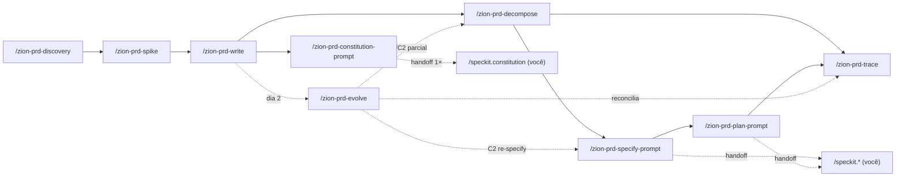

# Como usar o Zion Build PRD → Spec Kit (exemplos do Zion Mermaid Editor)

> **Governança:** este documento é **guia de uso**, não normativo. Os requisitos do harness vivem
> em [`docs/prd.md`](../prd.md) e a arquitetura em [`docs/architecture.md`](../architecture.md) —
> as fontes da verdade deste repo.

> **O que este documento é:** um **guia prático** dos comandos `/prd-*` — o harness que
> *executa* o processo do `guia-prd-para-spec-kit.md`. Enquanto aquele guia **descreve** os seis
> estágios de forma genérica, este mostra **como rodar** cada comando, com exemplos reais do
> **Zion Mermaid Editor**.
>
> **Fronteira, sempre:** a PRD e o input do `/speckit.specify` carregam *o-quê / por-quê*; o
> `plan.md` de cada feature carrega *como / com quê*. Stack só aparece nos **ADRs** (Estágio 2) e
> no `plan.md` — nunca na PRD. As regras vivem em `assets/quality-rules.md`.

---

## Instalação

Instale via [skills.sh](https://skills.sh):

    npx skills add tuyoshivinicius/zion-build-prd

Isso instala as 10 skills em `.claude/skills/` do seu projeto. Instale o **Spec Kit** à parte — as pontes `/zion-prd-constitution-prompt`, `/zion-prd-specify-prompt` e `/zion-prd-plan-prompt` apenas montam os prompts do `/speckit.*`.

## Quando usar o harness (e quando não)

- **Use o harness** (`/prd-*`) quando quiser que o Claude **dirija** o fluxo: perguntar o que falta,
  validar entrada e saída, formatar no padrão e delegar à skill real. Menos passos manuais.
- **Use o guia narrativo** (`guia-prd-para-spec-kit.md`) quando quiser entender o *porquê* de cada
  estágio, ou executar algum passo à mão.
- **Todo gate aconselha, nunca bloqueia.** Cada comando emite um veredito (`✓` / `⚠ + sugestão`) e
  **você decide** seguir. Nada trava você.

---

## Mapa rápido dos comandos

| Comando | Estágio | Lê (pré-requisito) | Produz | Delega a |
|---|---|---|---|---|
| `/zion-prd-discovery` | 1 · Descoberta | *(nada)* | `docs/discovery.md` | `superpowers:brainstorming` |
| `/zion-prd-spike` | 2 · Spikes + ADRs | `docs/discovery.md` | `docs/adr/ADR-00x-*.md` | `deep-research` → `zion-adr-new` |
| `/zion-prd-write` | 3 · PRD enxuta | `docs/discovery.md` + `docs/adr/` | `docs/PRD.md` | `superpowers:brainstorming` |
| `/zion-prd-decompose` | 4 · Decomposição | `docs/PRD.md` (com `RF-xx`) | specs + `docs/backlog.md` + tabela na PRD | `superpowers:brainstorming` |
| `/zion-prd-constitution-prompt` | Ponte p/ 5a (bootstrap, 1×) | `docs/PRD.md` (NFRs+ADRs) | prompt do `/speckit.constitution` | *(monta em prosa; sem delegação)* |
| `/zion-prd-specify-prompt` | Ponte p/ 5b | backlog de specs | prompt do `/speckit.specify` | *(monta em prosa; zero-stack verificado por `check-prd.sh`)* |
| `/zion-prd-plan-prompt` | Ponte p/ 5c | `spec.md` da feature + `docs/adr/` | prompt do `/speckit.plan` | *(monta em prosa; sem delegação)* |
| `/zion-prd-trace` | 6 · Rastreabilidade | `docs/PRD.md` (§6+§12) + `docs/backlog.md` + `specs/` | §12 + backlog reconciliados | `scripts/trace-prd.sh` + `trace-backlog.sh` |
| `/zion-prd-evolve` | 7 · Dia 2 (pós-release) | `docs/PRD.md` + a mudança | §13 + edições roteadas | `/zion-adr-new`, `/zion-prd-decompose`, `/zion-prd-trace`, `/zion-prd-specify-prompt` |

O harness termina na ponte: o ciclo `/speckit.*` (specify → clarify → plan → … → implement) é **seu**.

> **Correspondência com o `guia-prd-para-spec-kit.md`:** aqui cada ponte é um comando numerado
> (5a `constitution` · 5b `specify` · 5c `plan`); lá a `constitution` é o Passo 5a (bootstrap) e as
> pontes `specify`/`plan` vivem **dentro** do Passo 5b, o ciclo do Spec Kit por feature.



---

## Caminho feliz, ponta a ponta, com o Zion

O Zion parte de um stub em `docs/index.md` ("Editor de diagrama mermaid com experiência visual").
Abaixo, o fluxo completo — o que **você digita** e o que o comando **faz/responde**.

### Estágio 1 — `/zion-prd-discovery`

Você digita:

```text
/zion-prd-discovery Um editor de diagramas mermaid com experiência visual: a pessoa escreve
mermaid e vê a prévia atualizar ao digitar, e também consegue editar o diagrama direto no
canvas. Público: quem documenta arquitetura de software.
```

O comando **valida a entrada** (Fase 1): tem problema + persona candidata? ✓. Se você tivesse
colado "vou usar React + mermaid.js", ele avisaria: *"⚠ isso é stack — cedo demais; aqui é só visão
e escopo"*. Depois **delega a `brainstorming`** com o enquadramento fixo (visão-1-frase, persona,
faz/não-faz) e grava `docs/discovery.md`.

Resultado esperado em `docs/discovery.md`:

```markdown
## Visão
Para quem documenta arquitetura de software, que perde tempo alternando entre a sintaxe mermaid e a
prévia, o Zion é um editor visual que atualiza a prévia ao digitar e deixa editar no canvas.

## Persona
- **Ana, engenheira de software** — mantém diagramas de arquitetura no repositório e quer iterar
  rápido sem decorar sintaxe.

## Faz / Não faz
- **Faz:** editar mermaid por texto; prévia ao vivo; editar no canvas; exportar imagem.
- **Não faz (out):** colaboração multiusuário em tempo real; controle de versão tipo git;
  diagramas não-mermaid (PlantUML, draw.io); login/conta na primeira release.
```

**Fase 4 (veredito):** `✓ visão em 1 frase · ✓ persona nomeada (Ana) · ✓ "não faz" explícito`.

> **Nova sessão / retomar:** rodar `/zion-prd-discovery` de novo com `docs/discovery.md` já
> existente **não** recomeça do zero — entra em **modo retomar/revisar** (preserva o sólido,
> pressiona o incompleto). Passe o que quer rever como argumento (ex.: "quero rever a persona");
> sem argumento, ele varre os blocos fracos. Se já houver ADRs/PRD, avisa para considerar
> `/zion-prd-evolve`.

### Estágio 2 — `/zion-prd-spike`

As **2–3 decisões estruturantes** são as que mudam a PRD inteira (não dúvidas pequenas). O argumento
é **opcional** — a Fase 1 é de mão dupla.

**Se você já as conhece,** passe-as e o comando **só valida** cada uma pelo filtro *"isso muda a PRD
inteira?"*. Para o Zion:

```text
/zion-prd-spike Três decisões estruturantes:
1. Motor de renderização do diagrama (mermaid.js oficial vs. render próprio).
2. Sincronização bidirecional texto ↔ canvas (round-trip do diagrama).
3. Onde o diagrama persiste entre sessões.
```

**Se ainda não as enxerga,** rode **sem argumento** (ou com só 1–2) e o comando **lê o
`docs/discovery.md` e propõe** as que faltam — cada uma ancorada num trecho do discovery — e pede
para você **confirmar / editar / substituir**. Discovery magro (ex.: sem o quadro Faz/Não faz)? Ele
**aponta a lacuna** e sugere enriquecer via `/zion-prd-discovery` em vez de inventar eixos fracos — sem
travar.

O comando roda, por decisão: **`deep-research`** (trade-offs) → **`zion-adr-new`** (registra o ADR).
Aqui **stack pode e deve aparecer** — o ADR é o lar do "como". Saída:

```text
docs/adr/ADR-001-motor-de-renderizacao.md
docs/adr/ADR-002-sincronizacao-texto-canvas.md
docs/adr/ADR-003-persistencia-local.md
```

**Fase 4:** roda `references/check-adr.sh docs/adr/` e ecoa o veredito — confere a **presença** da
evidência do tipo certo por ADR (spike de código para risco de execução; fonte de pesquisa para risco
de conhecimento), não a qualidade. Advisório: *"complete a evidência ou justifique"*, não reverte.
Cada ADR aceito vira **restrição** na seção 8 da PRD.

**Decisão dada.** Nem toda decisão estruturante tem dúvida a provar: às vezes ela já chega batida de
fora (política da org, restrição externa, padrão já estabelecido). Aí o lastro é o **racional
escrito**, não um spike. Dois caminhos:

- **Direto:** `/zion-adr-new "Provider de nuvem" --dada` — a skill conduz um **micro-diálogo** curto
  (quem bateu o martelo, que restrição força, o que ficou de fora, que trade-off você aceita) e grava
  `Evidência: Decisão dada: <racional>`. Se você já passar o racional (`--dada "mandato de infra…"`),
  ela sonda só os buracos.
- **Via Fase 1 do spike:** classifique a decisão como *decisão dada* (o terceiro rótulo, ao lado de
  execução e conhecimento); a Fase 2/3 roda o mesmo micro-diálogo e registra o ADR sem spike nem
  pesquisa.

O `check-adr.sh` reconhece o marcador `Decisão dada:` e cobra só a **presença** do racional (não a
qualidade) — campo em branco segue erro.

### Estágio 3 — `/zion-prd-write` (o coração)

```text
/zion-prd-write
```

Sem argumento: trabalha sobre `docs/discovery.md` + `docs/adr/`. **Fase 2** copia
`assets/templates/prd-skeleton.md` → `docs/PRD.md` (13 seções em branco). **Fase 3** delega a
`brainstorming` para preencher **seção a seção**. Trecho da PRD resultante:

```markdown
## 6. Requisitos funcionais por épico (RF-xx)
- **Épico E1 — Edição por texto com prévia:**
  - `RF-01` A pessoa escreve mermaid e vê a prévia renderizar ao digitar.
  - `RF-02` Erros de sintaxe são apontados sem descartar a última prévia válida.
- **Épico E2 — Edição visual no canvas:**
  - `RF-03` Arrastar um nó no canvas atualiza o texto mermaid correspondente.
  - `RF-04` Adicionar um nó/aresta pelo canvas passa a constar no texto.
- **Épico E3 — Persistência e exportação:**
  - `RF-05` As alterações do diagrama persistem entre sessões.
  - `RF-06` A pessoa exporta o diagrama como imagem.

## 7. NFRs (com números)
- `NFR-01` A prévia atualiza em até 200 ms após a digitação parar.
- `NFR-02` Diagramas de até 200 nós mantêm interação abaixo de 100 ms.
```

**Fase 4 — guarda de fronteira.** As três regras decidíveis (zero-stack, `RF-xx` por épico, NFR com
número) são verificadas **por máquina** — a skill roda `references/check-prd.sh prd docs/PRD.md` e
ecoa o veredito com o número da linha de cada achado. O julgamento subjetivo (critério de aceite ou
tela vazando em prosa) fica com o LLM. Se uma linha vazar, aponta a linha exata e sugere mover para o
`plan.md`. Gate aconselha, não bloqueia.

### Estágio 4 — `/zion-prd-decompose`

```text
/zion-prd-decompose
```

Delega a `brainstorming`: agrupa `RF-xx` em épicos → story map → cortes de release → **specs
verticais**. Cada spec é validada pelo **INVEST** (teste-relâmpago: *"esta spec, sozinha, dá uma
demo ponta-a-ponta?"*). Para o Zion:

- **R0 (walking skeleton):** *digitar mermaid → ver prévia → recarregar e continuar.* Corta E1+E3 no
  mínimo e prova o pipeline texto→render→persistência inteiro. É a spec zero.
- **R1:** apontar erro de sintaxe (`RF-02`); exportar imagem (`RF-06`).
- **R2:** editar no canvas — arrastar nó (`RF-03`), adicionar nó (`RF-04`).

E **injeta a tabela** de `assets/templates/traceability-table.md` na **seção 12** da PRD:

```markdown
| RF | Descrição (1 frase) | Épico | Feature / Spec | Release | Status |
|----|---------------------|-------|----------------|---------|--------|
| RF-01 | Prévia renderiza ao digitar | E1 | `specs/001-preview-ao-vivo` | R0 | ☐ pendente |
| RF-05 | Diagrama persiste entre sessões | E3 | `specs/001-preview-ao-vivo` | R0 | ☐ pendente |
| RF-02 | Erro de sintaxe apontado | E1 | `specs/002-erros-sintaxe` | R1 | ☐ pendente |
```

E **semeia o backlog** `docs/backlog.md` (fila de specs; slug/demo/RFs humanos, Pasta/Status por máquina):

```markdown
| Spec (slug) | Demo (1 frase) | RFs | Release | Pasta | Status |
|-------------|----------------|-----|---------|-------|--------|
| preview-ao-vivo | Digitar mermaid, ver prévia, recarregar e continuar | RF-01, RF-05 | R0 | — | ☐ pendente |
| erros-sintaxe | Erro de sintaxe apontado sem perder a prévia | RF-02 | R1 | — | ☐ pendente |
```

> **Migrando um backlog antigo (formato "fatia"):** o `trace-backlog.sh` só aceita o formato novo, sem
> retrocompatibilidade. Num `docs/backlog.md` já existente, renomeie na linha de cabeçalho os dois
> rótulos — `Fatia (slug)` → **`Spec (slug)`** e a coluna de máquina `Spec` → **`Pasta`** — e, na
> legenda, `◐ em spec` → **`◐ em especificação`**. É uma edição de uma linha (mais a legenda); depois
> rode `/zion-prd-trace` normalmente.

### Ponte (bootstrap, 1×) — `/zion-prd-constitution-prompt`

Roda **uma vez por projeto**, depois que a PRD tem NFRs e restrições de ADRs. Deriva princípios
**decidíveis** deles:

```text
/zion-prd-constitution-prompt Enfatize render e persistência; derive o resto dos NFRs.
```

Monta o prompt em **prosa** seguindo `#anatomia-constitution` e **entrega o comando pronto** (não
dispara nada):

```text
/speckit.constitution "Crie princípios derivados destes NFRs e restrições da PRD: NFR-01
(render < 100ms ao digitar), NFR-02 (persistência sobrevive a reload); ADR-001 (motor de render),
ADR-003 (persistência local). Cada princípio deve ser decidível — com um critério objetivo
(validador, limiar numérico ou teste) — e rastreável ao NFR ou ADR de origem. Evite princípios
genéricos como 'código limpo' ou 'boa cobertura'."
```

**PARE.** A partir daqui o ciclo `/speckit.*` é seu.

### Ponte — `/zion-prd-specify-prompt`

Aponte **qual** spec da fila. Para o walking skeleton:

```text
/zion-prd-specify-prompt A spec R0: digitar mermaid, ver a prévia, recarregar e o diagrama continuar.
```

Monta o prompt em **prosa** seguindo `#anatomia-specify` e **entrega o comando pronto** (não dispara
nada):

```text
/speckit.specify "O usuário abre o editor, digita um diagrama mermaid e vê a prévia renderizar ao
digitar; ao recarregar a página, o diagrama e a prévia continuam lá. Contexto: RF-01 (prévia ao
digitar), RF-05 (persistência entre sessões); vale a restrição da ADR-003. Não inclua linguagem,
framework ou bibliotecas — a stack fica no plan."
```

**PARE.** A partir daqui o ciclo `/speckit.*` é seu.

### Ponte — `/zion-prd-plan-prompt`

Depois do `specify`+`clarify` da spec, leve a feature ao `plan` honrando o que o spike provou:

```text
/zion-prd-plan-prompt A feature R0 (prévia ao digitar + persistência): honre os ADRs de render e de persistência local.
```

Lê o `spec.md` da spec, cruza com `docs/adr/`, propõe os ADRs relevantes para você confirmar, e
monta o prompt em **prosa** seguindo `#anatomia-plan`. **Entrega o comando pronto** (não
dispara nada):

```text
/speckit.plan "Realize o spec.md desta feature (prévia ao digitar + persistência entre sessões)
honrando estas decisões já fechadas, sem reabri-las: ADR-001 (motor de render escolhido), ADR-003
(persistência local escolhida). Descreva a stack, a arquitetura e as restrições técnicas que
decorrem dessas decisões e realizam o resultado observável do spec.md."
```

**PARE.** A partir daqui o ciclo `/speckit.*` é seu.

### Dia 2 — `/zion-prd-evolve` (quando um requisito muda pós-release)

O harness não termina na release 1. Quando um requisito muda depois — um RF novo, um RF alterado/removido
ou uma decisão que caiu —, `/zion-prd-evolve` é o ponto de entrada único. Exemplo:

```text
/zion-prd-evolve Exportar PNG saiu de escopo; agora exportamos SVG — o motor de render atual não gera vetor.
```

Ele **classifica** (aqui é C2 **e** C3: o RF mudou *e* a decisão do motor caiu), **confirma com você** e
mostra o **plano de toque**:

> Plano de toque (C2+C3):
> 1. §13 changelog — eu escrevo a linha da mudança. *(inline)*
> 2. §6/§8 — eu edito o RF de exportação e a restrição. *(inline)*
> 3. Supersessão do ADR do motor → `/zion-adr-new "Motor de exportação vetorial" --substitui ADR-002`. *(gate)*
> 4. Re-fatiar o épico de exportação → `/zion-prd-decompose --epico E3`. *(gate)*
> 5. Spec já especificada → `/zion-prd-specify-prompt` em modo re-specify. *(gate)*
> 6. Reconciliar a tabela → `/zion-prd-trace`. *(gate)*
> 7. O ADR alimentava a constitution? Aconselho rodar `/zion-prd-constitution-prompt` de novo. *(aviso)*

Executa inline só o barato e local (§13 + edição pontual) e **para em cada gate**, delegando um por vez.
A Fase 4 roda `check-prd.sh` (confere a §13 e a §8) e `check-adr.sh` (confere a simetria da supersessão).
**Termina na ponte:** o ciclo `/speckit.*` é seu.

---

## Os gates em ação (o que você vê)

O harness **aconselha, não bloqueia**. Cinco situações concretas:

### 1. Gate mole dispara, mas não trava
Rodar `/zion-prd-write` **sem** `docs/discovery.md`:

> ⚠ Não encontrei `docs/discovery.md`. Recomendo rodar `/zion-prd-discovery` e `/zion-prd-spike` antes.
> Quer seguir mesmo assim?

Responda "sim" e ele prossegue. (Prova: aconselha, não bloqueia.)

### 2. Fronteira vazada — aponta a linha
Se a seção 6 da PRD tiver:

```markdown
- `RF-03` Usar React Flow para arrastar nós no canvas.
```

`/zion-prd-write` em modo revisar responde:

> ⚠ Vazamento de fronteira em `RF-03`: cita **React Flow** (biblioteca). Isso é "como" → move para o
> `plan.md` da feature. Reescreva o `RF-03` como resultado: *"Arrastar um nó no canvas atualiza o
> texto mermaid"* (veja `quality-rules.md` `#fronteira`).

### 3. Idempotência — modo revisar
Vale para os estágios que mantêm um artefato vivo. Rodar `/zion-prd-write` com `docs/PRD.md` **já
existente**: ele **não sobrescreve** — entra em modo *pressionar seção a seção*, apontando o que
está fraco na PRD atual. O mesmo vale para `/zion-prd-discovery` com `docs/discovery.md` **já
existente**: entra em **modo retomar/revisar** (preserva o que está sólido, pressiona o incompleto).
Se já houver downstream (`docs/adr/` ou `docs/PRD.md`), avisa para considerar `/zion-prd-evolve` na
mudança estrutural. Uma **nova sessão de discovery** é só rodar o comando de novo.

### 4. INVEST reprova spec horizontal
Dar ao `/zion-prd-decompose` uma spec "só o canvas visual, sem ligar ao texto":

> ⚠ Spec horizontal: é "só a UI" — não passa no teste "dá uma demo sozinha?". Sugiro refatiar pelos
> eixos do **SPIDR** (ex.: começar pela **I**nterface mínima que já lê e escreve o texto).

### 5. Handoff termina o território
As pontes **entregam** o texto e **param** — nunca disparam um `/speckit.*`.
`/zion-prd-constitution-prompt` entrega o `/speckit.constitution` (bootstrap, 1×),
`/zion-prd-specify-prompt` entrega o `/speckit.specify` (por spec) e `/zion-prd-plan-prompt`
entrega o `/speckit.plan` (por feature, honrando os ADRs). O ciclo do Spec Kit é seu.

---

## Onde afinar o padrão

Tudo num lugar só — mexa aqui, não nos comandos:

- **Regras de qualidade** (fronteira, critérios de conclusão, INVEST/SPIDR, anatomia do specify):
  `assets/quality-rules.md`.
- **Esqueleto da PRD** (13 seções): `assets/templates/prd-skeleton.md`.
- **Tabela de rastreabilidade:** `assets/templates/traceability-table.md`.

> Após editar qualquer arquivo em `assets/`, rode `./scripts/sync-assets.sh` para propagar às skills e `./scripts/check-assets.sh` para garantir que não há drift.

Os comandos `/prd-*` **apontam** para esses arquivos em vez de repetir as regras — afinar o padrão
de qualidade é editar um arquivo só.

---

## Resumo de bolso

1. `/zion-prd-discovery <ideia>` → `docs/discovery.md` (visão, persona, faz/não-faz).
2. `/zion-prd-spike [2–3 decisões]` → `docs/adr/` — traga-as ou deixe a IA propor do discovery; aqui stack pode aparecer.
3. `/zion-prd-write` → `docs/PRD.md` (RF-xx por épico, **sem stack**).
4. `/zion-prd-decompose` → specs verticais + tabela na PRD; R0 = walking skeleton.
5. `/zion-prd-constitution-prompt` (1×) → `/speckit.constitution "..."` pronto → **você** dispara o bootstrap.
6. `/zion-prd-specify-prompt <spec>` → `/speckit.specify "..."` pronto → **você** dispara o Spec Kit.
7. `/zion-prd-plan-prompt <feature>` → `/speckit.plan "..."` pronto (honra os ADRs) → **você** dispara o plan.
