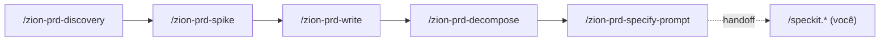
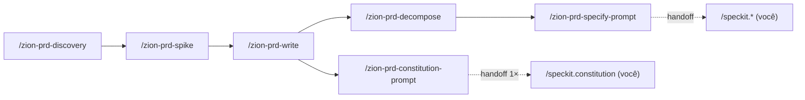

# `/zion-prd-constitution-prompt` Implementation Plan

> **For agentic workers:** REQUIRED SUB-SKILL: Use superpowers:subagent-driven-development (recommended) or superpowers:executing-plans to implement this plan task-by-task. Steps use checkbox (`- [ ]`) syntax for tracking.

**Goal:** Adicionar ao harness-prd a skill `/zion-prd-constitution-prompt` — ponte para o Passo 5a (bootstrap) que monta o prompt do `/speckit.constitution` derivando princípios decidíveis dos NFRs/ADRs da PRD, entrega e para.

**Architecture:** Espelha `/zion-prd-specify-prompt` (mesma anatomia de 4 fases, delega a `zion-rewrite-prompt`, referencia âncoras da fonte única `.specify/prd/quality-rules.md`, para no handoff). A guarda muda de "sem-stack" para "decidível-não-genérico ∧ rastreável a NFR/ADR". Adiciona duas âncoras à fonte única e sincroniza os dois guias.

**Tech Stack:** Markdown puro (skill do Claude Code com frontmatter YAML). Sem build, sem testes automatizados — a verificação de cada task é `grep`/`test -f`, no estilo do plano `2026-07-11-harness-prd-spec-kit.md`.

**Spec de referência:** `docs/superpowers/specs/2026-07-12-prd-constitution-prompt-design.md`

---

## Estrutura de arquivos

| Arquivo | Ação | Responsabilidade |
|---|---|---|
| `.claude/skills/zion-prd-constitution-prompt/SKILL.md` | Criar | A skill-ponte do Passo 5a (4 fases + handoff). |
| `.specify/prd/quality-rules.md` | Modificar | +critério `constitution-prompt`; +âncora `#anatomia-constitution`. |
| `docs/como-usar-o-harness-prd.md` | Modificar | Tabela, fluxo mermaid, seção da ponte, gate #5, resumo de bolso. |
| `docs/guia-prd-para-spec-kit.md` | Modificar | Nota no Passo 5a; linha `zion-rewrite-prompt` cita P5a+P5b. |

Ordem deliberada: **fonte única primeiro** (Task 1) para que a skill (Task 2) possa referenciar âncoras que já existem; depois os guias (Tasks 3–4).

---

### Task 1: Adicionar critério e âncora à fonte única (`quality-rules.md`)

**Files:**
- Modify: `.specify/prd/quality-rules.md`

- [ ] **Step 1: Adicionar o critério `constitution-prompt` em `#criterios-de-conclusao`**

Substitua o bloco existente (linha ~46-47):

```markdown
- **specify-prompt**: o prompt gerado declara resultado observável ∧ não cita stack ∧ RF-xx/ADR
  entram como contexto (referência), não como requisito.
```

por:

```markdown
- **specify-prompt**: o prompt gerado declara resultado observável ∧ não cita stack ∧ RF-xx/ADR
  entram como contexto (referência), não como requisito.
- **constitution-prompt**: o prompt gerado deriva princípios **decidíveis** (cada um com validador/
  limiar/teste) ∧ cada princípio rastreia a um NFR ou restrição de ADR ∧ **zero** princípio genérico
  ("código limpo", "boa cobertura").
```

- [ ] **Step 2: Adicionar a âncora `#anatomia-constitution` após a seção `#anatomia-specify`**

No fim do arquivo, depois do último bullet de `## Anatomia do prompt do specify {#anatomia-specify}` (o bullet `<success_criteria>` que termina em "então já antecipa o gate."), adicione:

```markdown

## Anatomia do prompt do constitution {#anatomia-constitution}

O input do `/speckit.constitution` também é um prompt, montado a partir da PRD. As tags que pagam o
custo:

- `<context>` — **a fonte, não o princípio pronto**: os NFRs (`NFR-xx`) e as restrições de ADRs
  entram como material de origem para derivar os princípios; não são princípios já formatados.
- `<instructions>` — pede para **derivar** princípios decidíveis dessa fonte (um por
  NFR/restrição relevante).
- `<constraints>` — o **guardião da decidibilidade**: escreva explícito "cada princípio tem um
  critério objetivo (validador / limiar numérico / teste) e rastreia a um NFR ou ADR; proibido
  genérico ('código limpo', 'boa cobertura')". Impede platitude de virar princípio.
- `<success_criteria>` — todo princípio é **decidível** ∧ **rastreável** a um NFR/ADR; nenhum
  genérico. É o que torna a `constitution` cobrável depois.
```

- [ ] **Step 3: Verificar as duas adições**

Run: `grep -nE 'constitution-prompt|#anatomia-constitution' .specify/prd/quality-rules.md`
Expected: 2 linhas — o critério `- **constitution-prompt**:` e o header `## Anatomia do prompt do constitution {#anatomia-constitution}`.

- [ ] **Step 4: Commit**

```bash
git add .specify/prd/quality-rules.md
git commit -m "feat(prd): quality-rules ganha critério e anatomia do constitution-prompt"
```

---

### Task 2: Criar a skill `zion-prd-constitution-prompt`

**Files:**
- Create: `.claude/skills/zion-prd-constitution-prompt/SKILL.md`

- [ ] **Step 1: Criar o diretório e o arquivo com o conteúdo completo**

Crie `.claude/skills/zion-prd-constitution-prompt/SKILL.md` com exatamente:

````markdown
---
name: zion-prd-constitution-prompt
description: Ponte para o Spec Kit — monta o prompt do /speckit.constitution derivando princípios decidíveis dos NFRs/restrições da PRD, e entrega para você disparar
argument-hint: "Opcional: áreas/princípios a enfatizar na constitution (senão, deriva dos NFRs/ADRs da PRD)"
metadata:
  author: zion-mermaid-editor
user-invocable: true
disable-model-invocation: false
---

# zion-prd-constitution-prompt — Ponte do harness para o Spec Kit (Passo 5a)

Prepara o input do `/speckit.constitution` — o **bootstrap, uma vez por projeto**. Monta o prompt
que deriva princípios **decidíveis** dos NFRs e restrições (ADRs) da PRD, entrega pronto e para — o
ciclo `/speckit.*` é seu. Regras em `.specify/prd/quality-rules.md`.

## Fase 0 — Pré-requisito (aconselha)
Deve existir `docs/PRD.md` (saída de `/zion-prd-write`) com NFRs e restrições vindas de ADRs. Não depende
de `/zion-prd-decompose`. Se não houver PRD, avise ("recomendo `/zion-prd-write` antes") e pergunte se segue.
Lembre que isto é bootstrap: roda **uma vez por projeto**.

## Fase 1 — Validar entrada bruta (aconselha)
Colha os NFRs mensuráveis e as restrições dos ADRs — é deles que os princípios saem. Se um princípio
proposto é **genérico** ("código limpo", "boa cobertura") sem critério objetivo, ou **não rastreia**
a nenhum NFR/ADR, avise: "princípio não decidível/rastreável" (veja `quality-rules.md`
`#anatomia-constitution`). A guarda aqui **não** é "sem-stack" — a constitution carrega padrões
técnicos transversais de propósito; a guarda é **decidibilidade + rastreabilidade**. Não bloqueie.

## Fase 2/3 — Formatar e auto-delegar
Invoque `zion-rewrite-prompt` no mesmo turno para montar o prompt do `constitution`, seguindo
`quality-rules.md` `#anatomia-constitution`:
- `<context>` — os NFRs (`NFR-xx`) e restrições de ADRs como **fonte** (material de origem), não
  como princípio já pronto.
- `<instructions>` — **derivar** princípios decidíveis dessa fonte.
- `<constraints>` — blinda a decidibilidade: cada princípio tem validador/limiar/teste e rastreia a
  um NFR/ADR; proíbe genérico.
- `<success_criteria>` — todo princípio é decidível ∧ rastreável; nenhum genérico.

## Fase 4 — Validar saída e handoff (aconselha)
Confira contra o critério **constitution-prompt** de `#criterios-de-conclusao`: princípios decidíveis
∧ rastreáveis a NFRs/ADRs ∧ zero genérico. Então **entregue o comando pronto** para o usuário
disparar, por exemplo:

    /speckit.constitution "<prompt montado>"

**PARE AQUI.** Não invoque `/speckit.constitution` nem qualquer `/speckit.*` — o ciclo do Spec Kit é
do usuário. Este é o fim do território do harness.

## Saída
Um `/speckit.constitution "..."` pronto para colar, mais o veredito das checagens da Fase 4.
````

- [ ] **Step 2: Verificar o arquivo e seus marcadores**

Run: `test -f .claude/skills/zion-prd-constitution-prompt/SKILL.md && grep -E 'name: zion-prd-constitution-prompt|zion-rewrite-prompt|#anatomia-constitution|PARE AQUI' .claude/skills/zion-prd-constitution-prompt/SKILL.md`
Expected: as 4 linhas presentes (`name:`, `zion-rewrite-prompt`, a referência `#anatomia-constitution`, e `PARE AQUI`).

- [ ] **Step 3: Commit**

```bash
git add .claude/skills/zion-prd-constitution-prompt/SKILL.md
git commit -m "feat(prd): comando zion-prd-constitution-prompt (ponte para o Passo 5a)"
```

---

### Task 3: Sincronizar `como-usar-o-harness-prd.md`

**Files:**
- Modify: `docs/como-usar-o-harness-prd.md`

- [ ] **Step 1: Adicionar linha na tabela "Mapa rápido dos comandos"**

Substitua:

```markdown
| `/zion-prd-specify-prompt` | Ponte p/ 5b | backlog de fatias | prompt do `/speckit.specify` | `zion-rewrite-prompt` |
```

por:

```markdown
| `/zion-prd-constitution-prompt` | Ponte p/ 5a (bootstrap, 1×) | `docs/PRD.md` (NFRs+ADRs) | prompt do `/speckit.constitution` | `zion-rewrite-prompt` |
| `/zion-prd-specify-prompt` | Ponte p/ 5b | backlog de fatias | prompt do `/speckit.specify` | `zion-rewrite-prompt` |
```

- [ ] **Step 2: Atualizar o fluxo mermaid**

Substitua:



por:



- [ ] **Step 3: Adicionar a seção da ponte de bootstrap antes da seção do specify**

Localize `### Ponte — /zion-prd-specify-prompt` e insira **antes** dela:

````markdown
### Ponte (bootstrap, 1×) — `/zion-prd-constitution-prompt`

Roda **uma vez por projeto**, depois que a PRD tem NFRs e restrições de ADRs. Deriva princípios
**decidíveis** deles:

```text
/zion-prd-constitution-prompt Enfatize render e persistência; derive o resto dos NFRs.
```

Delega a `zion-rewrite-prompt` montando as tags de `#anatomia-constitution` e **entrega o comando pronto**
(não dispara nada):

```text
/speckit.constitution "
<context>
Fonte (NFRs e restrições, não princípios prontos): NFR-01 (render < 100ms ao digitar),
NFR-02 (persistência sobrevive a reload). ADR-001 (motor de render), ADR-003 (persistência local).
</context>
<instructions>
Derive um princípio decidível por NFR/restrição relevante.
</instructions>
<constraints>
Cada princípio tem critério objetivo (validador / limiar numérico / teste) e rastreia a um NFR/ADR.
Proibido genérico ('código limpo', 'boa cobertura').
</constraints>
<success_criteria>
Todo princípio é decidível e rastreável a um NFR/ADR; nenhum genérico.
</success_criteria>
"
```

**PARE.** A partir daqui o ciclo `/speckit.*` é seu.
````

- [ ] **Step 4: Atualizar o gate #5 (handoff) para citar as duas pontes**

Substitua:

```markdown
### 5. Handoff termina o território
`/zion-prd-specify-prompt` **entrega** o texto do `/speckit.specify` e **para** — nunca dispara um
`/speckit.*`. O ciclo do Spec Kit é seu.
```

por:

```markdown
### 5. Handoff termina o território
As duas pontes **entregam** o texto e **param** — nunca disparam um `/speckit.*`.
`/zion-prd-constitution-prompt` entrega o `/speckit.constitution` (bootstrap, 1×) e
`/zion-prd-specify-prompt` entrega o `/speckit.specify` (por fatia). O ciclo do Spec Kit é seu.
```

- [ ] **Step 5: Atualizar o "Resumo de bolso"**

Substitua:

```markdown
5. `/zion-prd-specify-prompt <fatia>` → `/speckit.specify "..."` pronto → **você** dispara o Spec Kit.
```

por:

```markdown
5. `/zion-prd-constitution-prompt` (1×) → `/speckit.constitution "..."` pronto → **você** dispara o bootstrap.
6. `/zion-prd-specify-prompt <fatia>` → `/speckit.specify "..."` pronto → **você** dispara o Spec Kit.
```

- [ ] **Step 6: Verificar as edições**

Run: `grep -cE 'zion-prd-constitution-prompt' docs/como-usar-o-harness-prd.md`
Expected: `4` (tabela, nó do mermaid, header da seção da ponte, resumo de bolso). Se o gate #5 citar o nome também, será `5` — qualquer valor ≥ 4 confirma que as inserções entraram; confira visualmente que tabela, mermaid, seção e resumo têm a menção.

- [ ] **Step 7: Commit**

```bash
git add docs/como-usar-o-harness-prd.md
git commit -m "docs(harness): guia de uso reflete a ponte /zion-prd-constitution-prompt"
```

---

### Task 4: Sincronizar `guia-prd-para-spec-kit.md`

**Files:**
- Modify: `docs/guia-prd-para-spec-kit.md`

- [ ] **Step 1: Adicionar nota da ponte no Passo 5a**

Localize a linha do critério de conclusão do Passo 5a:

```markdown
- **Critério de conclusão:** `constitution` escrita e rastreável aos NFRs da PRD.
```

e insira **logo após** ela:

```markdown
- **Ponte do harness:** `/zion-prd-constitution-prompt` monta esse prompt para você — deriva princípios
  decidíveis dos NFRs/ADRs, entrega o `/speckit.constitution "..."` pronto e **para** (o comando do
  Spec Kit é seu).
```

- [ ] **Step 2: Atualizar a linha `zion-rewrite-prompt` na tabela de skills**

Substitua:

```markdown
| `zion-rewrite-prompt` | `/zion-rewrite-prompt` ou "reescrever/estruturar prompt" | **Montar o prompt do `/speckit.specify` (P5b)** — uso central: `<constraints>` blinda a fronteira "sem stack" e `<success_criteria>` antecipa o gate `clarify`. |
```

por:

```markdown
| `zion-rewrite-prompt` | `/zion-rewrite-prompt` ou "reescrever/estruturar prompt" | **Montar o prompt do `/speckit.constitution` (P5a)** — `<constraints>` blinda a decidibilidade dos princípios — **e do `/speckit.specify` (P5b)** — `<constraints>` blinda a fronteira "sem stack" e `<success_criteria>` antecipa o gate `clarify`. |
```

- [ ] **Step 3: Verificar as edições**

Run: `grep -nE 'Ponte do harness|constitution.* \(P5a\)' docs/guia-prd-para-spec-kit.md`
Expected: 2 linhas — a nota da ponte no Passo 5a e a menção "(P5a)" na linha do `zion-rewrite-prompt`.

- [ ] **Step 4: Commit**

```bash
git add docs/guia-prd-para-spec-kit.md
git commit -m "docs(guia): Passo 5a cita a ponte /zion-prd-constitution-prompt"
```

---

### Task 5: Verificação final de coerência

**Files:** (nenhum — só checagem)

- [ ] **Step 1: Confirmar que a skill existe e casa com a fonte única**

Run: `test -f .claude/skills/zion-prd-constitution-prompt/SKILL.md && grep -q 'constitution-prompt' .specify/prd/quality-rules.md && grep -q 'anatomia-constitution' .specify/prd/quality-rules.md && echo OK`
Expected: `OK`

- [ ] **Step 2: Confirmar que a skill referencia a âncora que existe na fonte única**

Run: `grep -q '#anatomia-constitution' .claude/skills/zion-prd-constitution-prompt/SKILL.md && grep -q '{#anatomia-constitution}' .specify/prd/quality-rules.md && echo REF-OK`
Expected: `REF-OK` (a referência da skill aponta para uma âncora que de fato existe).

- [ ] **Step 3: Confirmar árvore de trabalho limpa**

Run: `git status --porcelain`
Expected: saída vazia (tudo commitado nas Tasks 1–4).

---

## Self-Review (executado ao escrever o plano)

**Cobertura do spec:**
- Skill `zion-prd-constitution-prompt` com 4 fases + handoff → Task 2. ✓
- Guarda decidível-não-genérico ∧ rastreável (não "sem-stack") → Fase 1 da skill (Task 2, Step 1) + `<constraints>` de `#anatomia-constitution` (Task 1). ✓
- Delegar a `zion-rewrite-prompt` → Fase 2/3 da skill (Task 2). ✓
- Critério `constitution-prompt` + âncora `#anatomia-constitution` na fonte única → Task 1. ✓
- `como-usar`: tabela, mermaid, seção da ponte, gate #5, resumo de bolso → Task 3. ✓
- `guia`: nota no Passo 5a + linha `zion-rewrite-prompt` cita P5a → Task 4. ✓
- Fora de escopo (não disparar `/speckit.*`, não editar `constitution.md`, decompose não é pré-req) → respeitado; "PARE AQUI" na skill e pré-requisito é só a PRD. ✓

**Placeholders:** nenhum "TBD/TODO"; todo conteúdo de arquivo está literal.

**Consistência de nomes:** `#anatomia-constitution`, `constitution-prompt`, `/speckit.constitution`, `NFR-xx` usados de forma idêntica entre a fonte única (Task 1), a skill (Task 2) e os guias (Tasks 3–4).
